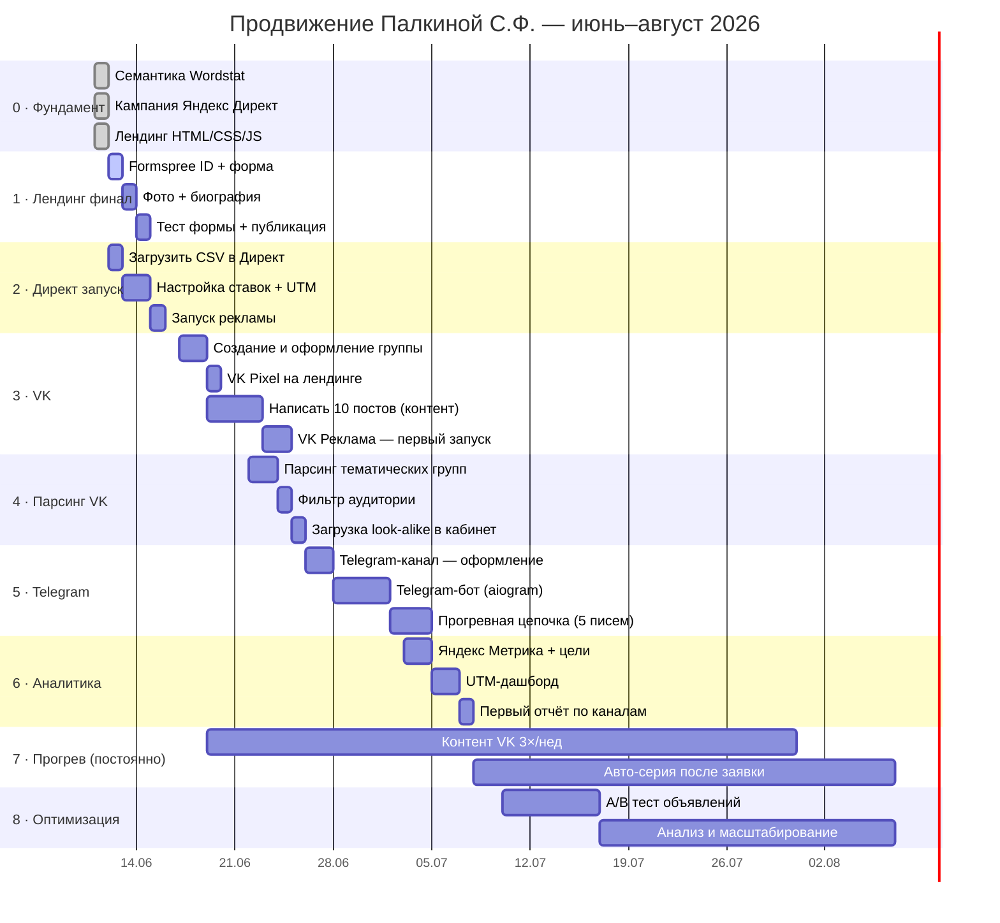

# Полный план продвижения — Палкина Светлана Филаретовна
*Психотерапевт · супружеские и партнёрские отношения*

---

## Статус по этапам

| # | Этап | Статус | Срок |
|---|---|---|---|
| 0 | Фундамент (семантика, Директ, лендинг) | ✅ Готово | Выполнено |
| 1 | Лендинг — финализация (Formspree, фото, биография) | ⏳ Ожидает | Неделя 1 |
| 2 | Яндекс Директ — запуск кампании | ⏳ Ожидает | Неделя 1 |
| 3 | VK — сообщество + контент | 🔲 Не начато | Неделя 2 |
| 4 | Парсинг аудитории VK + таргет | 🔲 Не начато | Неделя 2–3 |
| 5 | Telegram-канал + бот | 🔲 Не начато | Неделя 3–4 |
| 6 | Яндекс Метрика + аналитика | 🔲 Не начато | Неделя 4 |
| 7 | Прогрев: контент-серия + авто-цепочка | 🔲 Не начато | Постоянно с нед.2 |
| 8 | Оптимизация и масштабирование | 🔲 Не начато | Месяц 2+ |

---

## График (Gantt)

---

## Детали каждого этапа

---

### Этап 1 · Лендинг — финализация
**Цель:** страница готова к трафику

Что сделать:
- [ ] Зайти в Formspree → Формы → Новая форма → скопировать ID → вставить в `landing/script.js:97`
- [ ] Добавить фото Светланы в `landing/index.html` (заменить блок с инициалами СП)
- [ ] Заполнить блок "Обо мне" — образование, подход, опыт
- [ ] Открыть `landing/index.html` в браузере → заполнить форму → проверить что заявка пришла на почту
- [ ] Опубликовать на хостинге (GitHub Pages / Timeweb / любой)

**Результат:** лендинг принимает заявки

---

### Этап 2 · Яндекс Директ — запуск
**Цель:** первые клики идут на лендинг

Что сделать:
- [ ] `python ad_campaign/main.py --url https://ВАШ-САЙТ.ru` → получить `output/direct_campaign.csv`
- [ ] Войти в Яндекс Директ → Инструменты → Импорт/Экспорт → загрузить CSV
- [ ] Добавить к каждой группе URL-параметр `?g=ГРУППА` (измена, развод и т.д.)
- [ ] Установить дневной бюджет (рекомендую 300–500 ₽/день на старте)
- [ ] Включить только поисковую сеть на первые 2 недели

**Результат:** первые заявки с поиска через 1–3 дня

---

### Этап 3 · VK — сообщество и контент
**Цель:** органическая аудитория + канал для прогрева

Что сделать:
- [ ] Создать бизнес-сообщество VK: тип «Публичная страница»
- [ ] Оформить: обложка, аватар, описание, контакты, кнопка «Записаться»
- [ ] Написать и запланировать 10 постов (контент-план ниже)
- [ ] Подключить VK Pixel → вставить код на лендинг
- [ ] Запустить таргет: женщины 28–50, интересы «психология», «семья», «отношения»

**Контент-план VK (темы):**
1. "Почему пары откладывают обращение к психологу до последнего"
2. "3 признака, что кризис в браке — не конец"
3. "Что происходит на первой сессии (без страха неизвестности)"
4. "Измена: 5 вопросов, которые стоит задать себе до решения"
5. "История пары (анонимно): как вышли из двухлетней холодности"
6. "Почему 'просто поговорить' не работает в конфликте"
7. "Онлайн-терапия vs очная: что выбрать паре"
8. "Когда один хочет терапию, а второй нет — что делать"
9. "Стоимость сессии vs стоимость развода (честный разговор)"
10. "Запись открыта: как выглядит первые 3 сессии"

**Результат:** 200–500 подписчиков за месяц, прогрев аудитории

---

### Этап 4 · Парсинг аудитории VK
**Цель:** точный таргет на людей с высоким интентом

Что это: стандартный инструмент VK-маркетинга — парсинг *участников групп* (не личных страниц)
для загрузки в рекламный кабинет как целевая аудитория.

Инструменты: **TargetHunter** (платный, ~700 ₽/мес) или **Pepper.ninja**

Что парсить:
- Участники групп: «Психология отношений», «Семейный психолог», «Женская психология»
- Фильтры: активные за 30 дней, возраст 28–50, замужем/в отношениях
- Исключить: участников групп психологов-конкурентов (уже знают о конкурентах)

Загрузить в VK Рекламу → «Ретаргетинг» → «Загрузить аудиторию»

**Результат:** аудитория 5 000–20 000 человек с высоким интентом, CPL ниже на 30–50%

---

### Этап 5 · Telegram — канал и бот
**Цель:** прогрев + автоматический приём заявок 24/7

#### Telegram-канал
- Название: «Светлана Палкина | Психотерапевт для пар»
- Дублировать посты из VK (или уникальный формат — голосовые заметки, короткие мысли)
- Ссылка на канал — в bio лендинга и в VK

#### Telegram-бот
Команды:
- `/start` — приветствие + кнопки «Записаться» / «Узнать стоимость» / «Вопрос»
- `/price` — прайс и формат работы
- `/book` — форма записи (имя + телефон → уведомление Светлане)
- `/faq` — 5 частых вопросов
- Свободный ввод → авто-ответ «Светлана ответит в течение 2 часов»

#### Прогревная цепочка (после подписки на бота):
- День 0: «Привет! Я Светлана, психотерапевт для пар...» + ссылка на статью
- День 2: «Один вопрос: с чем чаще всего обращаются ко мне пары?»
- День 4: Кейс (анонимно) — короткая история выхода из кризиса
- День 7: «Первая сессия — знакомство. Без давления и обязательств»
- День 10: Мягкий призыв к записи

**Результат:** заявки в боте без лендинга + тёплая аудитория в канале

---

### Этап 6 · Яндекс Метрика + аналитика
**Цель:** знать что работает и не сливать бюджет

- Установить счётчик Метрики на лендинг
- Настроить цель: отправка формы (JavaScript-событие)
- Настроить цель: клик на кнопку «Записаться»
- UTM-метки уже в кампании → в Метрике видно какая группа даёт заявки
- Еженедельный мини-отчёт: визиты / заявки / CPL по каналу

**Ключевые метрики:**
| Метрика | Хорошо | Тревожно |
|---|---|---|
| Конверсия лендинга | > 3% | < 1% |
| CPL (цена заявки) | < 800 ₽ | > 2000 ₽ |
| Открытие бота (CTR) | > 40% | < 15% |

---

### Этап 7 · Прогрев (постоянный)
**Цель:** люди, которые не записались сразу, вернулись через 2–4 недели

- VK: 3 поста в неделю по контент-плану
- Telegram: 2–3 поста в неделю (можно дублировать VK)
- Ретаргетинг VK/Директ на посетителей лендинга (пиксели уже настроены)
- Авто-серия в Telegram после первого контакта (5 писем за 10 дней)

---

### Этап 8 · Оптимизация (месяц 2+)
- A/B тест: 2 варианта hero-заголовка лендинга (`?g=` уже готов)
- Масштабировать группы объявлений с CPL < 800 ₽
- Отключить группы с CPL > 2000 ₽ после 50 кликов
- Добавить отзывы на лендинг (социальное доказательство)
- Подключить онлайн-запись (Calendly или YouCan)

---

## Что уже сделано ✅

| Модуль | Файлы |
|---|---|
| Семантика (Wordstat) | `scraper.py`, `classifier.py`, `main.py`, `config.py` |
| Кампания Яндекс Директ | `ad_campaign/copy.py`, `builder.py`, `export.py`, `main.py` |
| Лендинг | `landing/index.html`, `styles.css`, `script.js` |

## Что предстоит построить 🔲

| Модуль | Технология |
|---|---|
| VK-парсер аудитории | Python + VK API |
| Telegram-бот | Python + aiogram 3.x |
| Прогревная цепочка | aiogram + планировщик |
| Метрика — интеграция | JavaScript (2 строки на лендинг) |

---

*Следующий активный шаг: **Этап 1** — финализация лендинга (Formspree + фото + биография)*
